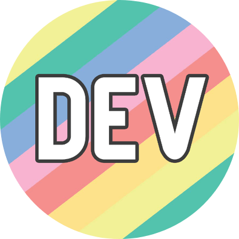

### Hello, World! </h2>

Eu sou a Daniani, vegetariana, espiritualista, apaixonada por tecnologia, administração, informações e pesquisas. 

Empreendedora desde os 14 anos, amo trabalhar por conta própria e tudo que envolve esse mundo.

Formada em técnicos de Informática, Administração e Contabilidade. Sou autodidata e atualmente estudo Programação e UX/UI designer.

Divido meu tempo entre ser dona de casa, esposa, meus trabalhos, estudos, ver séries, filmes, desenhos, jogar (tabuleiro e retrogames), meditar e ser feliz.

Amo cozinhar, organizar, pesquisar, estudar, conhecer, questionar e ajudar as pessoas.

Se quiser conversar, pode me achar aqui:

<a href="https://www.linkedin.com/in/danianith"></img></a> [LinkedIn](https://www.linkedin.com/in/danianith)  <a href="https://www.twitter.com/danianith"></img></a> [Twitter](https://www.twitter.com/danianith)  <a href="https://https://dev.to/danianith"></img></a> [DEV](https://dev.to/danianith) 

---

### Skills
 

</img> </img> </img>  </img>
</img> </img> </img>  

---

 
